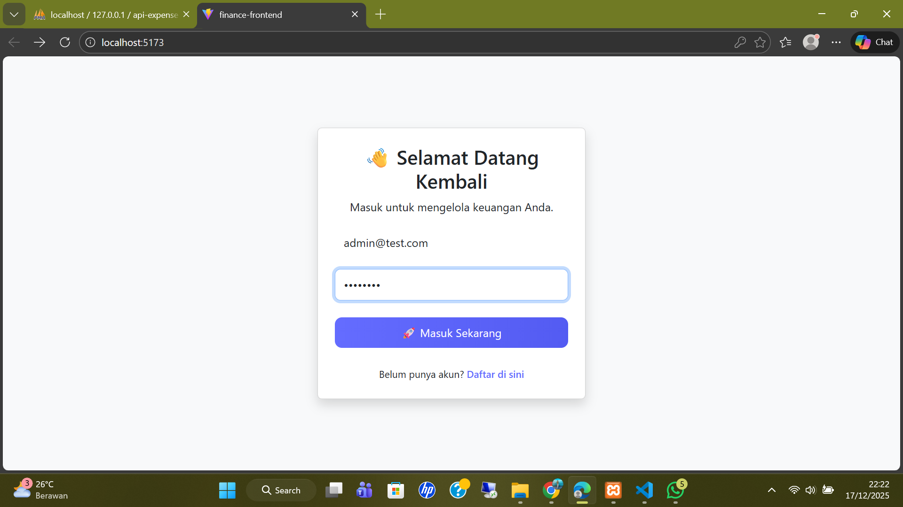
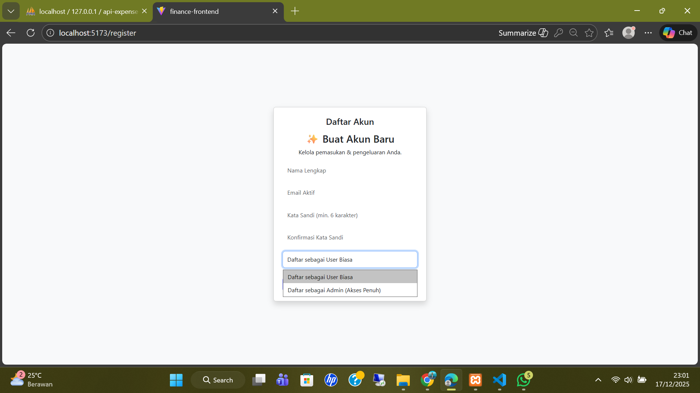
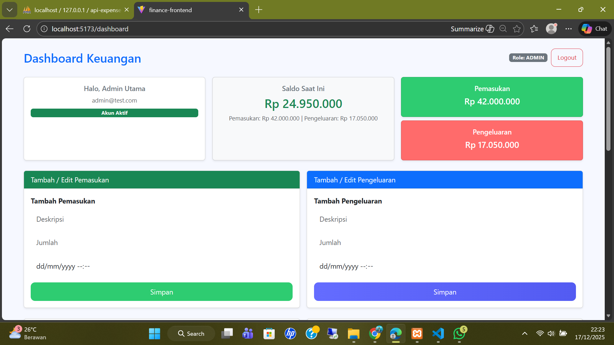
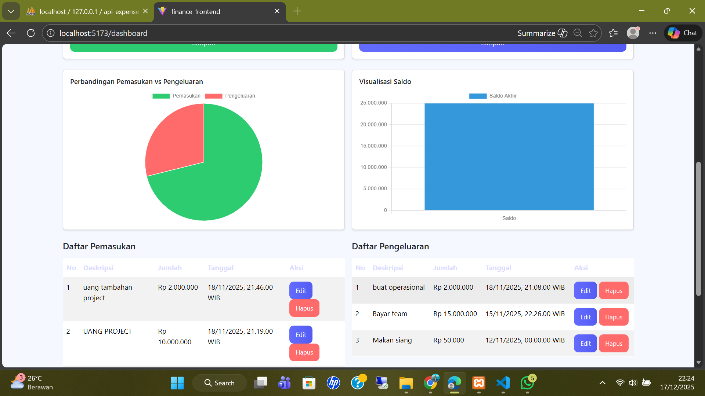
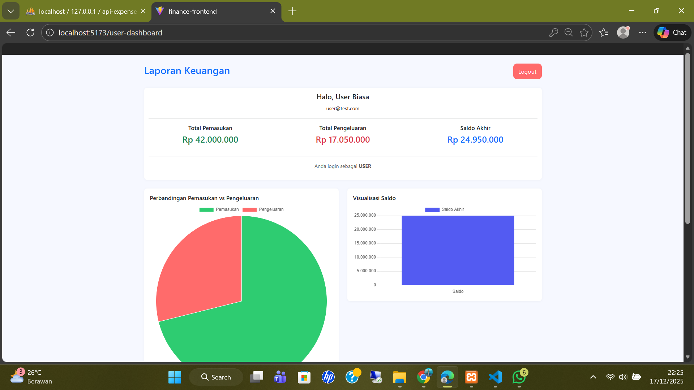
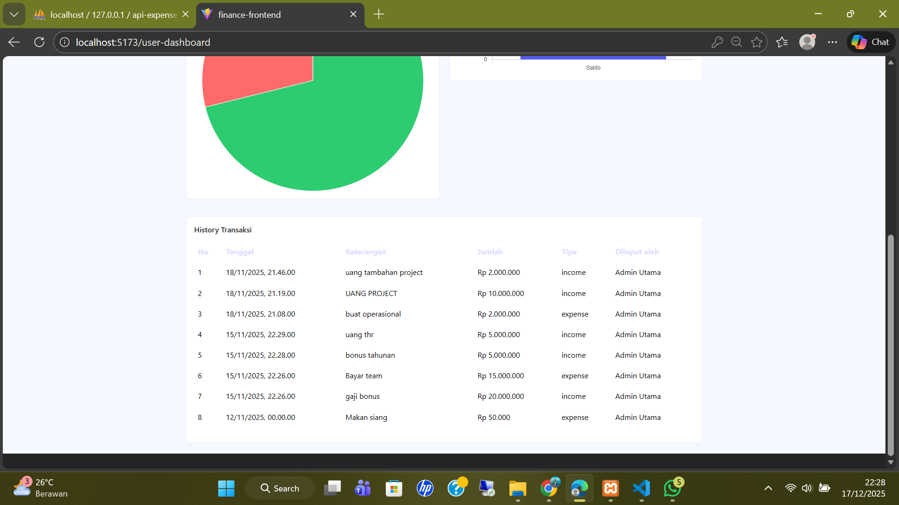

# 💰 Personal Expense Tracker API & Frontend

[](https://vitejs.dev/)
[](https://reactjs.org/)
[](https://www.apachefriends.org/)

Sistem aplikasi web modern untuk mencatat pemasukan dan pengeluaran keuangan secara terorganisir. Dilengkapi dengan manajemen role (Admin & User) dan analisis data yang intuitif.

---

## ✨ Fitur Utama
* **Multi-Role Auth**: Sistem login dan registrasi khusus untuk Admin dan User.
* **Dashboard Interaktif**: Visualisasi data pemasukan dan pengeluaran.
* **Manajemen Keuangan**: CRUD (Create, Read, Update, Delete) data transaksi.
* **Riwayat Transaksi**: Log lengkap aktivitas keuangan user.

---

## 📸 Dokumentasi Antarmuka

### 🔐 Autentikasi
Sistem keamanan menggunakan validasi akun untuk menjaga privasi data keuangan.

| Login | Register (Multi-Role) |
|---|---|
|  |  |

> **Catatan:** User dapat mendaftar sebagai Admin atau User biasa tergantung kebutuhan sistem.

---

### 👑 Panel Admin
Admin memiliki kontrol penuh untuk memantau aktivitas sistem dan manajemen data global.

**Dashboard Admin Overview**
<p align="center">
  
</p>

**Manajemen Data (CRUD)**
<p align="center">
  
</p>

---

### 👤 Panel User
Tampilan yang disederhanakan untuk membantu user fokus pada pencatatan keuangan pribadi.

**Dashboard User**
<p align="center">
  
</p>

**Riwayat Transaksi**
<p align="center">
  
</p>

---

## 🚀 Teknologi yang Digunakan

* **Frontend**: React.js (Vite)
* **Backend**: PHP (Laravel/Native - *Sesuaikan*)
* **Database**: MySQL (via XAMPP)
* **Styling**: CSS Modern / Tailwind ( *Sesuaikan*)

## 🛠️ Cara Instalasi

1. Clone repositori ini:
   ```bash
   git clone https://github.com/yovie21/Kas-Tracker-Project-Uas.git

2. Setup Backend (Laravel)
   -Jalankan Apache dan MySQL melalui XAMPP

   -Buat database baru melalui phpMyAdmin (contoh: personal_expense)

   -Masuk ke folder backend, lalu jalankan perintah berikut:
   ```bash
        composer install
   ```
   ```bash
        cp .env.example .env
   ```
   ```bash
        php artisan key:generate
   ```
4. Konfigurasikan database pada file .env:
   ```bash
    DB_DATABASE=personal_expense
    DB_USERNAME=root
    DB_PASSWORD=
   ```
5. Jalankan migrasi database:
    ```bash
    php artisan migrate
    ```
6. Jalankan server backend:
   ```bash
    php artisan serve
   ```
7. Backend akan berjalan di:
   ```bash
    http://127.0.0.1:8000
   ```
Setup Frontend (React + Vite)

Buka terminal baru (biarkan backend tetap berjalan)

Masuk ke folder frontend:
 ```bash
    cd finance-frontend
 ```
Install dependency:
 ```bash
   npm install
 ```
Jalankan frontend:
 ```bash
   npm run dev
 ```
 Frontend akan berjalan di:
  ```bash
  (http://localhost:5173)
 ```
